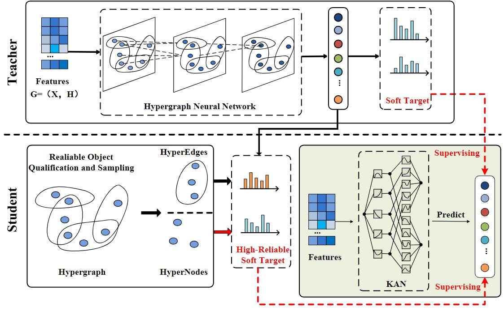

# LightHGNN
This repository contains the source code for the paper "HGNN2KAN: Distilling hypergraph neural networks into KAN for efficient inference" published in The 14th CCF International Conference on Natural Language Processing and Chinese Computing by Junzheng Li.



## Introduction
 which is based on the following environments:
* [python 3.9](https://www.python.org/): basic programming language.
* [dhg 0.9.4](https://github.com/iMoonLab/DeepHypergraph): for hypergraph representation and learning. 
* [torch 1.12.1](https://pytorch.org/): for computation.
* [hydra-core 1.3.2](https://hydra.cc/docs/intro/): for configuration and multi-run management.

## Installation 
1. Clone this repository.
2. Install the required libraries.
``` bash
pip install -r requirements.txt
```

## Usage
For transtive setting, you can run the following command:
```bash
python trans_train.py
```
For multi-run and obtain the average results, you can run the following command:
```bash
python trans_multi_exp.py
```
For production setting, you can run the following command:
```bash
python prod_train.py
```
For multi-run and obtain the average results, you can run the following command:
```bash
python prod_multi_exp.py
```

**Change Models**
You can change the teacher by modifying the `teacher` in `trans_config.yaml` and `prod_config.yaml` as following:
```yaml
model:
    teacher: hgnn # hgnn, hgnnp, hnhn, unigcn
```
Also, you can change the student by modifying the `student` in `trans_config.yaml` and `prod_config.yaml` as following:
```yaml
model:
    student: light_hgnn # light_hgnn, light_hgnnp
```

**Change Datasets**
In our paper, 13 grpah/hypergraph datasets are adopted for evaluation.
- Graph datasets: `cora`, `pubmed`, `citeseer`
- Hypergraph datasets: `news20`, `ca_cora`, `cc_cora`, `cc_citeseer`, `dblp4k_conf`, `dblp4k_paper`, `dblp4k_term`, `imdb_aw`, `recipe_100k`, `recipe_200k`

You can change the dataset by modifying the `dataset` in `trans_config.yaml` and `prod_config.yaml` as following:
```yaml
data:
    name: dblp4k_paper # cora, pubmed, news20, ca_cora, dblp4k_term, imdb_aw, ...
```
